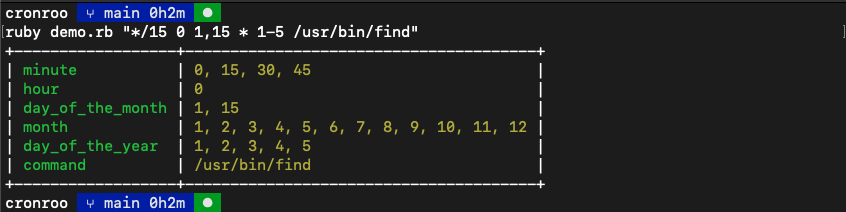

# cronroo

Welcome to my technical submission for Deliveroo's crontab parser technical test

This is implemented as a ruby program. 

## Installation

- Install Ruby 3.1.2 on your system.
- Install Git if you haven't already.
- Clone the repository using `git clone https://github.com/shellandbull/cronroo`.
- Navigate to the cloned directory.
- Run `bundle install` to install dependencies.
- Run `ruby demo.rb $CRONTAB_STRING`, replacing `$CRONTAB_STRING` with your desired cron expression.

### Additional notes

- I used https://crontab.guru/ for generating input test data
- I validated the crontab string using a regexp I found online
- I did not use an LLM but I did read some codebases that implemented a crontab string parser, I decided to just do it from scratch after finding them too terse to fit a 3 hour interview.
- Some scenarios are not covered for, but the core of it is implemented :smile:
